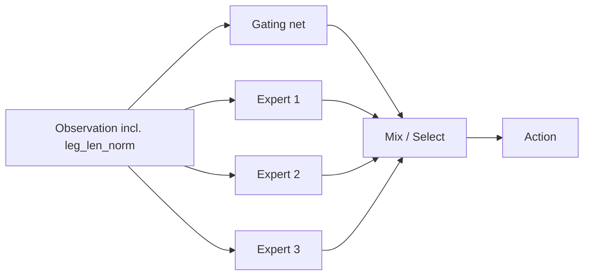

## NOTE: Alternative methods for a Chopstickbot uniform-leg policy

This note documents **alternatives** to our current approach (Option A: one morphology-conditioned policy, trained by switching among a pool of pre-generated XMLs).

It focuses on two families of approaches:
- **Distillation (teacher → student)**
- **MoE (Mixture-of-Experts)**

The goal is the same: learn a single policy that works for many leg lengths (morphologies), even when the “best gait” may differ by length.

---

## Background: why alternatives might be needed

Sometimes the optimal locomotion strategy is **not smooth** in leg length.

- **Example failure mode**: `len_0.20m` converges to a fast, high-frequency gait, while `len_0.30m` converges to a slower, longer-stance gait.  
  A single network may “average” them and become unstable, or overfit to whichever length it sees most recently.

When you see this, common symptoms are:
- Good performance on a subset of lengths, poor on others.
- Sudden “cliffs” in performance vs. length.
- Strong dependence on seed / training order.

---

## Option A (baseline, already implemented): pool switching with conditioning

**Idea**: train one PPO policy. Switch the XML across a finite pool (e.g., `len_0.20m`, `len_0.30m`, …), and feed `leg_len_norm` into observations.

**Pros**
- Simplest code path (one policy, one PPO run).
- No separate supervised pipeline.
- Works surprisingly often if the task/reward is not too multi-modal.

**Cons**
- Can still struggle if solutions are strongly multi-modal (different gaits).
- Requires enough model capacity and enough mixing to prevent forgetting.

---

## Alternative 1: Teacher → Student distillation

### 1.1 What it is

Train one or more **teacher** policies (often one per morphology or per length bucket), then train a **student** policy that takes `leg_len_norm` and imitates teacher behavior.

High-level:

```mermaid
flowchart LR
  subgraph Teachers
    T1[Teacher: len_0.20m] --> D[(Dataset)]
    T2[Teacher: len_0.50m] --> D
    T3[Teacher: len_2.00m] --> D
  end
  D --> S[Student: conditioned policy]
  S --> FT[PPO fine-tune across pool (optional)]
```

### 1.2 Common distillation targets

- **Action-mean regression**: student matches teacher mean action \( \mu(o, \ell) \).  
  Simple but can “average” conflicting modes.
- **Distribution distillation**: student matches the teacher distribution (e.g., KL between tanh-normal policies).  
  Better for multi-modal teachers; more stable than MSE on actions in some cases.
- **Value / advantage distillation** (optional): student matches teacher value estimates to speed RL fine-tune.

### 1.3 Tradeoffs

- **Pros**
  - Teachers can converge faster / more reliably per morphology (easier optimization).
  - Student training is supervised (stable), less sensitive to PPO noise.
  - Can reduce catastrophic forgetting compared to “long blocks per model”.

- **Cons**
  - Compute-expensive: train \(N\) teachers + distill + often still fine-tune with PPO.
  - Dataset coverage matters: student fails if it sees only narrow teacher trajectories.
  - If teachers learn *different* gaits, naive MSE distillation can collapse to an unstable average.

### 1.4 Practical “lightweight” distillation plan (recommended if you try it)

Instead of 50 teachers, use **5–10 representative teachers**:
- lengths near **min / max** and a few interior points
- optionally one teacher per “gait regime” you observe

Then:
- distill into a conditioned student
- do a short PPO fine-tune using Option A switching to recover robustness

---

## Alternative 2: MoE (Mixture-of-Experts)

### 2.1 What it is

MoE uses multiple expert sub-policies and a small **gating network** that chooses or mixes them.

Notation:
- Experts: \( \pi_k(a \mid o) \) for \(k=1..K\)
- Gate: \( w = g(o) \), usually \(w = \mathrm{softmax}(\cdot)\)

Two common outputs:
- **Soft mixture**: \( a = \sum_k w_k \, a_k \)
- **Hard selection**: choose \(k^\* = \arg\max_k w_k\), then \(a = a_{k^\*}\)



### 2.2 When MoE helps

MoE helps when “optimal behavior” is **multi-modal**:
- different gaits for different lengths
- different strategies for different commanded velocities / terrains

Instead of forcing one network to represent everything smoothly, you let experts specialize.

### 2.3 MoE training methods (three common variants)

#### (1) Two-stage (train experts first, then train gate)

- **Stage A**: train experts (separately or jointly, but no gate mixing).
  - Example: Expert 1 for short legs, Expert 2 for medium, Expert 3 for long.
- **Stage B**: freeze experts, train only gate/mixer.

**Pros**
- Stable and easy to reason about.
- Prevents “collapse” where only one expert learns.

**Cons**
- Experts may not be “mix-compatible” (different conventions/scales).
- Freezing experts can limit final quality.

#### (2) Joint training (experts + gate end-to-end with PPO)

Train everything together from scratch (or warm-start).

**Pros**
- Can discover complementary experts automatically.

**Cons**
- Collapse risk: gate always picks one expert; others starve and never learn.
- Often needs regularizers or balancing:
  - entropy on gate outputs
  - load-balancing loss (encourage uniform expert usage)
  - occasional expert dropout

#### (3) Semi-frozen / alternating

Example schedule:
- warm-start experts (or train a bit jointly)
- freeze gate, train experts
- freeze experts, train gate
- repeat

**Pros**
- Reduces collapse while still allowing co-adaptation.

**Cons**
- More moving parts and more hyperparameters.

### 2.4 Practical MoE plan for Chopstickbot (if Option A struggles)

Start small:
- **K = 3–5 experts**
- Gate conditioned on **`leg_len_norm` + command** (and optionally terrain mode)
- Prefer **soft mixture** first (simpler to train), then consider hard selection if mixing is unstable.

Recommended workflow:
- Train experts for *binned* lengths (short/mid/long) to convergence.
- Freeze experts; train gate on all lengths.
- Optional: short PPO fine-tune of the full MoE (semi-frozen schedule).

---

## Choosing between Option A vs Distillation vs MoE

### Quick decision guide

- **Option A works** if:
  - performance is smooth-ish vs. length
  - one network can cover all behaviors with enough capacity

- **Distillation helps** if:
  - you can train strong per-length teachers
  - you want a stable supervised stage
  - you can afford extra compute and build a dataset pipeline

- **MoE helps** if:
  - you see multiple distinct gait modes
  - a single network “averages” actions and becomes unstable
  - you want specialization without training dozens of full teachers

### Cost / complexity (roughly)

- **Option A**: lowest complexity, lowest compute
- **MoE**: medium complexity, medium compute
- **Many-teacher distillation**: highest complexity, highest compute

---

## Notes specific to this repo’s setup

- MJX/JAX requires fixed model structure per compiled `mjx.Model`, so all of these approaches still assume:
  - a **finite pool** of XMLs (per length), reused many times
  - morphology information passed into observations (e.g., `leg_len_norm`)

- If you use `num_evals=0` for speed:
  - eval/progress/W&B logging is reduced
  - you should still occasionally run eval to catch regressions across lengths

